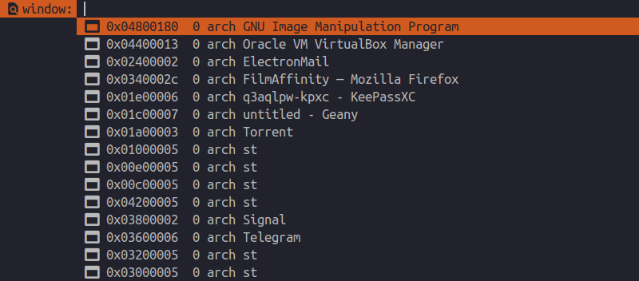
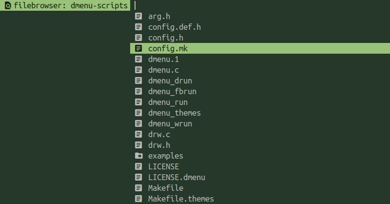

dmenu-scripts - My implementation of dmenu to simulate Rofi functions (run, drun, window, filebrowser and theme-selector)
=========================================================================================================================

### Dependencies:
  
  * **Arch Linux:**
    * `sudo pacman -S gcc make coreutils sed expat freetype2 libxinerama xdotool xorg-xlsclients dex xterm` 

  * **Debian/Ubuntu:**
    * `sudo apt install gcc make coreutils sed libexpat1-dev libfreetype-dev libxinerama-dev xdotool x11-utils dex xterm` 

### Build and install:

* Open terminal and run the following commands:

  ```shell
  $ git clone https://github.com/q3aql/dmenu-scripts
  $ sudo make install clean
  ````

### dmenu scripts that simulate Rofi:

  ```shell
  dmenu_run
  ```

 


  ```shell
  dmenu_drun
  ```

 


  ```shell
  dmenu_wrun
  ```

 


  ```shell
  dmenu_fbrun
  ```

 


  ```shell
  dmenu_themes
  ```

 
 
### External links:

  * [dmenu homepage](https://tools.suckless.org/dmenu/)
  * [Rofi homepage](https://github.com/davatorium/rofi)


